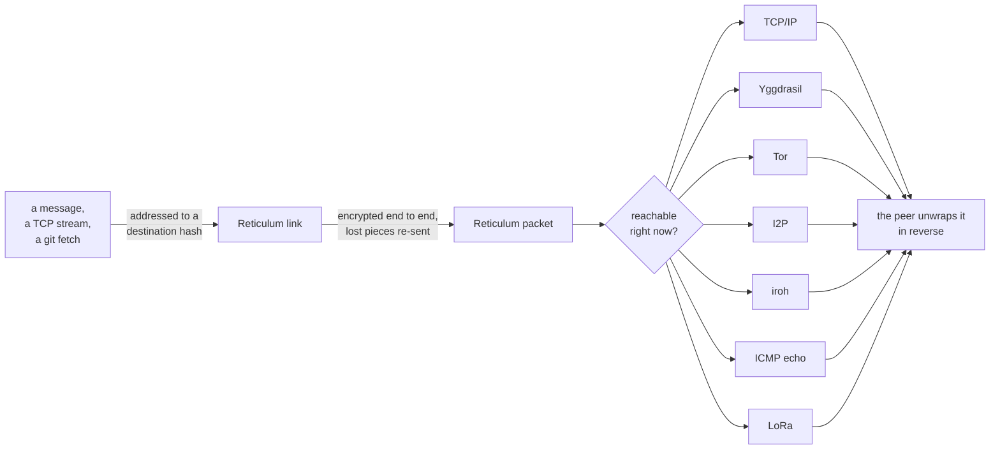

# resilum-core

A multi-transport Reticulum node: peers stay reachable over whichever
[interface](#interfaces) still works, and everything the node
[carries](#services) rides across it.

**Just want to run one?** → [Quick start](#quick-start).

## How it works

A node announces its destinations into the mesh and learns others' the same
way; there are no peer lists to maintain. When something needs to be sent —
a message, a git fetch, a TCP stream — the stack opens an end-to-end encrypted
link to a destination hash, and the link is carried by whichever interface can
reach it right now. If that interface dies, the next announce re-establishes
the path over another one, and the destination hash never changes.

Nothing above the link layer knows or cares which interface carried it. That is
what makes a node with a Yggdrasil address, an onion address and a QUIC
endpoint a single peer rather than three.

## Quick start

```sh
cd deploy && docker compose up -d
```

That is the whole setup. The image carries Tor, Yggdrasil and I2P already
wired, the entrypoint writes every config file on first start, and the node
joins the mesh with no editing at all. Identity and state persist in
`deploy/config/state`, so a restart keeps the same node.

To use the mesh as an internet egress, point a client at the SOCKS5 port —
`127.0.0.1:10808`, changed under `ingress.listen_tcp` in the config:

```sh
curl -x socks5h://127.0.0.1:10808 https://icanhazip.com
```

## How a byte travels

One message, top to bottom. Each step wraps what the step above handed it, and
only the last one touches the network you actually have.



The branch is the whole point: the destination hash is the
address, so the same peer stays the same peer whether the packet arrives over a
LAN cable, an onion circuit or an echo reply. When an interface dies, the next
announce re-establishes the path over another one and nothing above notices.

## Interfaces

| Interface | How it moves a packet | Status |
| --- | --- | --- |
| TCP/IP | public anchors, explicit `bootstrap`, LAN autodiscovery | ready |
| UDP | datagrams to the peers under `udp`, beside the TCP ones so one path dying does not isolate the node | ready |
| Yggdrasil | announce carries the node's `200::/7` address | ready, feature `ygg` |
| Tor | announce carries an onion address; external `tor` daemon serves it | ready |
| Tor (embedded) | in-process Tor client, no daemon on the host, outbound only | ready, feature `arti` |
| I2P | announce carries a `.b32.i2p` address, SAM bridge | ready, feature `i2p` |
| iroh | QUIC with hole-punching; relays only to introduce | ready, feature `iroh` |
| ICMP echo | frames ride inside echo payloads; the client needs no privileges, only a listening node wants a raw socket | ready |
| LoRa (RNode) | radio over USB; the stack drives it, the config here cannot name one yet | planned |
| WebRTC | the meeting point for two peers both behind carrier NAT, where no side has an address the other can dial — and the only transport a browser could speak | planned |
| BLE | GATT for the control plane, L2CAP channels for bulk; tens of kB/s, no infrastructure and no user interaction at all | planned |
| Wi-Fi Direct | tens of Mbps between devices with no router present; a Linux board can host the group, which is what phones on one platform cannot do | planned |
| BPv7 bundles | store-and-forward as a carrier: a bundle waits for the next contact instead of needing a live path, with custody handed over hop by hop | planned |
| RaptorQ coding | rides on top of another interface: send symbols until enough arrive, so a lossy or one-way path needs no round trip per gap — the fit for radio and for the covert carriers | planned |
| Sphinx packets | rides on top: fixed length and layered encryption, so no hop can link what came in to what went out | planned |
| Adaptive shaping | rides on top: packet-level strategies searched by a genetic algorithm rather than hand-written, for paths where a middlebox mangles traffic; separate project | planned |

Features are additive: a build with none of them still speaks TCP and finds
peers through the announce network.

## Services

| Service | What it does | Status |
| --- | --- | --- |
| Messaging (LXMF) | delivery destination for peer-to-peer messages | ready |
| Egress | reach the internet through a peer's Tor, I2P or plain exit | ready |
| L3 VPN | tun device with synthetic DNS, routes flows into the mesh | ready, unix |
| Nostr bridge | carries direct messages between the mesh and Nostr relays | ready |
| Git mirrors | announces rngit repositories this node serves | ready |
| Coordinates | latency map of the mesh, exposed for a UI graph | ready |
| Propagation node | hold messages for peers that are offline; the node speaks the client half of LXMF today, so it can collect its own but store none for others | planned |
| Message stamps | inbound messages can be priced in proof-of-work; the price is announced but no stamp is verified on arrival yet | partial |

## Coordinates: the mesh has a shape

Hop counts say nothing useful here. One hop can be a LAN cable and the next a
Tor circuit, so "two hops away" covers everything from 8 ms to 8 seconds. Nodes
therefore place themselves in a synthetic space where **distance is latency**:
each pair exchanges its position over an established link, measures the round
trip, and nudges its own coordinate until the space agrees with the
measurements. This is the Vivaldi algorithm, and it converges without any
central server or landmark set.

What the node keeps is a position, a height (the cost of its own last mile,
counted once instead of on every path) and an error estimate — how much it
still trusts itself. A peer's claim is weighted by *its* error, so a confident
node pulls harder than a freshly started one.

Two things this buys, in order of arrival:

- **A map.** The status snapshot exposes every peer's coordinate and estimated
  round trip, which is enough to draw the neighbourhood as a graph — near and
  far by responsiveness, not geography.
- **Choosing peers.** A node keeps a bounded set of links: the closest few plus
  a quota of deliberately distant ones, so the mesh does not fragment into
  cliques that all know each other and nothing else.

Coordinates are never put in an announce. An announce is public and
unauthenticated, and a position is both a fingerprint and an input an attacker
would control; they are exchanged only inside an established link, and every
incoming claim is bounds-checked before it can move anything.

## Where a node fits

The build is the same everywhere; the role follows from what the machine has.

| Machine | Role it ends up playing | What to enable |
| --- | --- | --- |
| VPS with a public address | anchor others dial, and a usable exit | `listen`, `egress` |
| Board on a home LAN | bridge between the LAN and the overlays | overlay features, no `egress` |
| Laptop or phone | plain client, joins and leaves | defaults, plus `ingress` to browse |

Acting as an exit is opt-in for a reason: peers' traffic leaves through this
host's address, with the same exposure as running any public exit.

## Configuration

One YAML file, documented inline:
[`deploy/config/resilumd.yaml.example`](deploy/config/resilumd.yaml.example).
It is copied to `resilumd.yaml` on first start, so an empty config directory is
a working node. Sections are opt-in — remove `egress` and the node stops
offering an exit, remove `nostr` and the bridge never starts.

## Development

One command runs fmt, lints, tests, supply chain and secret scanning — all of it:

```sh
./checker.sh
```

The daemon also runs outside a container, which is how it is usually debugged.
It takes one argument, the config file, and keeps state in `state/` beside it —
overlay daemons then have to come from the host:

```sh
cargo run -p resilumd -- deploy/config/resilumd.yaml.example
```

The release image reoptimises the whole core crate on every change. For a
test deploy, `PROFILE=quick` builds an unoptimised binary far faster:

```sh
docker buildx build --build-arg PROFILE=quick --load -t resilum:latest .
```

`checker.sh` fails when a tool is missing rather than skipping the step: a
skipped check reads like a passed one.
Open work is listed in [`Roadmap.md`](Roadmap.md).

## Verifying authenticity

Every commit is signed with a Reticulum identity, and the signature travels
inside the commit object — it verifies the same way regardless of which mirror
served the code. The canonical signing fingerprint is:

```text
bfc40491ae7214f8b773281f6c630eaf
```

Point git at the rngit signing helper (`rngcs`, shipped with RNS ≥ 1.4):

```sh
git config gpg.format ssh
git config gpg.ssh.program rngcs
git config gpg.ssh.allowedsignersfile none
git log --show-signature
```

A commit is authentic when the output reads `Good "git" signature for commit,
signed with Reticulum Identity key <bfc40491ae7214f8b773281f6c630eaf>`. When
fetching a release, pin the same fingerprint so a mirror cannot substitute
artifacts:

```sh
rngit release rns://<mirror>/resilum/resilum-core.git fetch latest:all \
  --signer bfc40491ae7214f8b773281f6c630eaf
```
